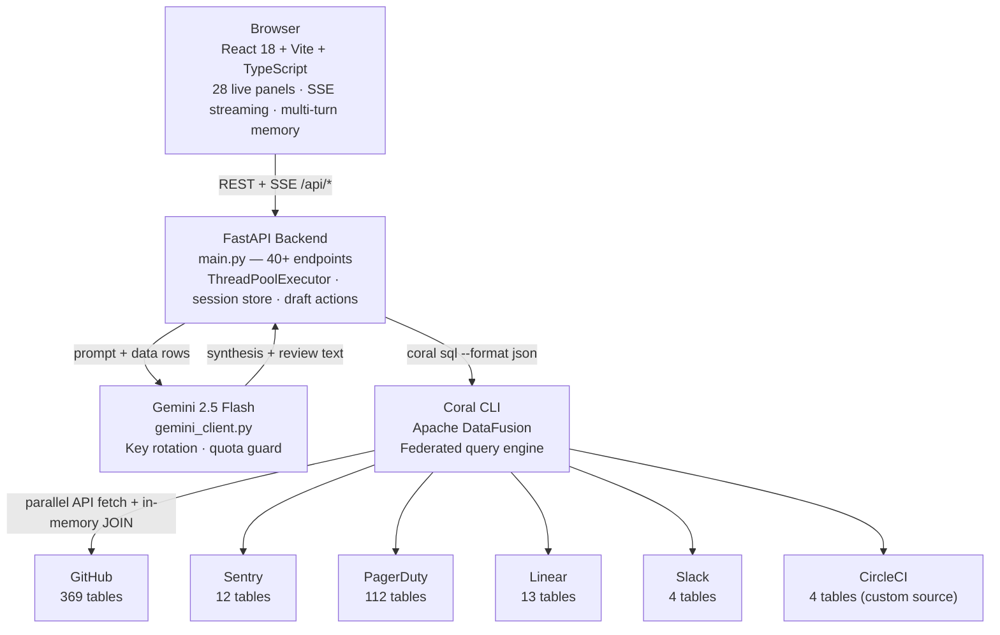
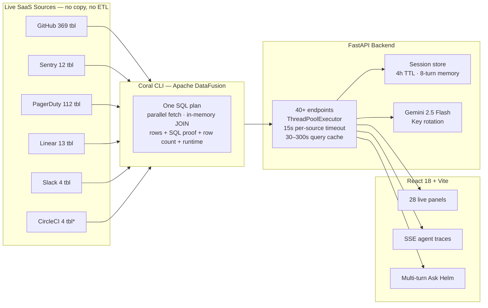
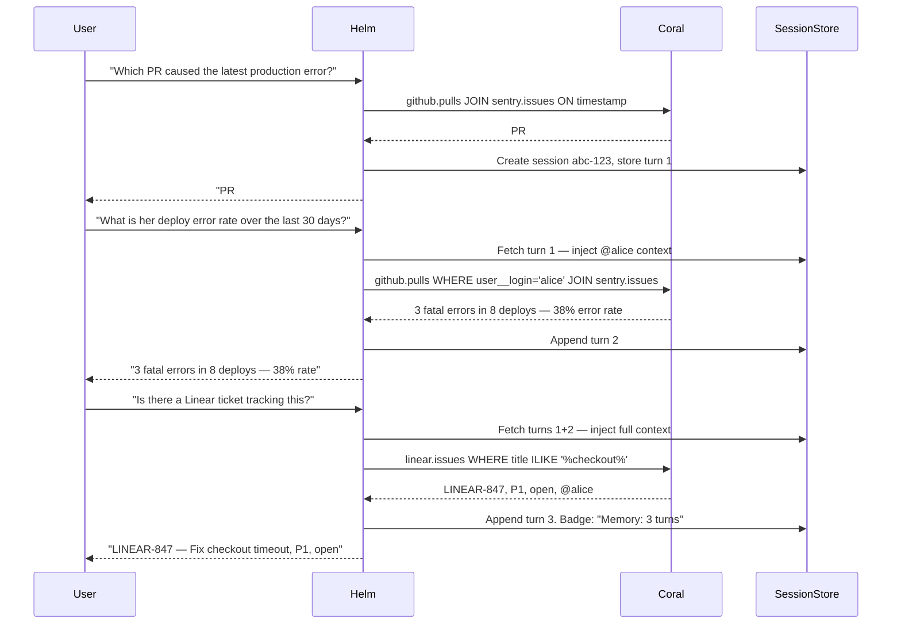
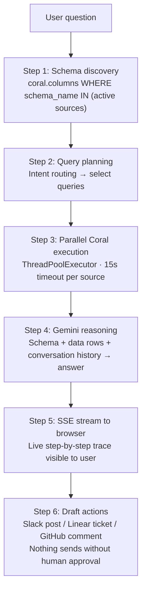

# Helm — Zero-ETL Federated Engineering Intelligence

Which pull request broke production, who is overloaded, and what SQL proof backs the answer?

Helm is a live engineering intelligence agent built on [Coral](https://withcoral.com) — a federated SQL runtime for live SaaS APIs. It joins GitHub, Sentry, PagerDuty, Linear, Slack, and CircleCI in a single SQL plan and delivers the answer in seconds with the exact query, row count, and runtime attached as proof.

No ETL. No warehouse. No copied JSON. No API stitching in Python.

---

## The Problem Helm Solves

Every ops tool shows data from one source at a time. The hard questions live at the intersection:

- Which PR merged right before Sentry first saw that fatal error?
- Which engineer has the most open Linear tickets AND the most Sentry error ownership?
- Which service is generating PagerDuty incidents faster than the team can respond in Slack?
- Which open PRs are blocking fixes for errors that are actively firing right now?
- Which PRs cleared CI but still introduced production errors?

These questions require a JOIN across systems that were never designed to talk to each other. Without Coral, answering them means: call GitHub API, paginate, call Sentry API, paginate, write Python to stitch timestamps, retry failures, pray the context window holds. With Coral, it is one SQL statement.

---

## System Architecture



### Backend module map

```
helm/
├── backend/
│   ├── main.py            — 40+ FastAPI endpoints, SSE streaming, session memory, parallel queries
│   ├── queries.py         — 25+ cross-source SQL functions
│   ├── coral_runner.py    — Coral CLI subprocess wrapper with in-process query cache
│   ├── gemini_client.py   — Gemini 2.5 Flash with automatic key rotation
│   ├── scoring.py         — burnout / stability / delivery scoring algorithms
│   └── readiness.py       — per-source health checks
├── frontend/
│   ├── src/
│   │   ├── App.tsx                      — routing, nav, panel layout, 28 panels
│   │   ├── api.ts                       — fetch functions and SSE stream parsers
│   │   ├── index.css                    — complete design system (~13,000 lines)
│   │   └── components/
│   │       ├── AskHelm.tsx              — multi-turn chat with session memory
│   │       ├── CircleCIPanel.tsx        — 3-source CI health + killer query
│   │       ├── ReviewDebtAging.tsx      — open PRs vs live errors
│   │       ├── TicketThreadTracker.tsx  — Linear tickets generating Slack noise
│   │       ├── CoralProof.tsx           — SQL proof panel and approval drafts
│   │       └── [20+ more panels]
└── sources/
    └── circleci/
        └── manifest.yaml  — custom Coral source spec (DSL v3, HeaderAuth, 4 tables)
```

---

## Data Flow



---

## The Query That Defines Helm

### How a query flows

1. Frontend calls `GET /api/demo-moment`
2. Backend runs `github.pulls JOIN sentry.issues ON timestamp window` via `coral sql --format json`
3. Coral translates SQL into parallel GitHub and Sentry API calls, joins inside DataFusion, returns rows
4. Backend packages the result with the exact SQL, row count, and runtime as proof
5. Frontend renders — every number on screen is live, with an attached query you can inspect

### Multi-turn session memory



Sessions expire after 4 hours of inactivity. Up to 8 prior turns are held in memory per session.

### Implementation details

- `_ASK_SESSIONS` dictionary in `main.py` — thread-safe with `threading.Lock`
- `session_id` (UUID) generated on first ask, returned in the SSE answer event
- Frontend stores `session_id` in a `useRef` — no re-renders, persists across the component lifecycle
- Prior turns injected into the Gemini prompt as `CONVERSATION HISTORY` before schema and data context
- "Memory: N turns" badge in the Ask Helm sidebar shows the active session state

---

## Agent Architecture



Two streaming agent endpoints:

- `/api/ask-stream` — multi-turn conversational Q&A with live schema grounding, session memory, and SSE step trace
- `/api/pr-review` — data-backed PR review: fetch PR → detect service → Sentry errors → PagerDuty incidents → author deploy history → author Linear load → Gemini synthesis → draft review comment
- `/api/handover-stream` — institutional knowledge brief: 6-month PR history + open Linear tickets + live error ownership, synthesised into a structured Handover Brief
- `/api/autopilot` — one-button incident response: 4-source constellation → evidence chain → draft Slack/Linear/GitHub actions

---

## Coral vs Direct API Calls

```
Without Coral (MCP tool loop):                With Coral SQL:

1. call GitHub API — paginate 3 pages          SELECT pr.title, s.title, pd.id
2. call Sentry API — paginate 2 pages            FROM github.pulls pr
3. write Python to match timestamps              JOIN sentry.issues s
4. call PagerDuty API                              ON s.first_seen BETWEEN
5. write Python to match service names               pr.merged_at
6. call Slack API                                    AND pr.merged_at + INTERVAL '24 hours'
7. write Python to match timestamps             LEFT JOIN pagerduty.incidents pd
8. dedupe, normalize, pass to LLM                  ON pd.service__summary ILIKE '%' || s.project || '%'
                                                LEFT JOIN slack.messages(channel => 'C123') sl
29 sequential tool calls                           ON sl.ts BETWEEN pd.created_at
~230s, often times out                              AND pd.created_at + INTERVAL '4 hours'
                                               WHERE pr.owner = 'myorg' AND pr.repo = 'myrepo'

                                               1 SQL query
                                               ~21s end-to-end
```

### Coral published retrieval benchmark (complex tasks, n=51)

| Metric | Direct MCP tool calls | Coral SQL |
| --- | --- | --- |
| Answer accuracy | baseline | +31% higher |
| Token cost | ~313k tokens | ~112k tokens (-70%) |
| Latency | ~230s | ~21s (-55%) |
| Audit trail | none | full SQL proof, row count, runtime |
| 4-source JOIN | not feasible (context overflow) | native DataFusion plan |

---

## The Killer Queries

### 1. PR to error causality (2 sources)

```sql
SELECT
    g.number      AS pr_number,
    g.title       AS pr_title,
    g.user__login AS author,
    g.merged_at,
    s.title       AS error_title,
    s.level,
    s.count       AS times_seen
FROM github.pulls g
JOIN sentry.issues s
    ON CAST(s.first_seen AS TIMESTAMP) >= CAST(g.merged_at AS TIMESTAMP)
   AND CAST(s.first_seen AS TIMESTAMP) <= CAST(g.merged_at AS TIMESTAMP) + INTERVAL '24 hours'
WHERE g.owner = 'myorg' AND g.repo = 'myrepo'
  AND g.state = 'closed'
  AND s.level IN ('error', 'fatal')
  AND CAST(g.merged_at AS TIMESTAMP) >= CAST(CURRENT_DATE AS TIMESTAMP) - INTERVAL '30 days'
ORDER BY g.merged_at DESC, s.count DESC
```

Runs on every page load of the Live Monitor. Tells you exactly which PR introduced which production error, bridged on the merge timestamp.

### 2. CI passed — still errored (3 sources, the new killer)

```sql
SELECT
    g.number      AS pr_number,
    g.title       AS pr_title,
    g.user__login AS author,
    c.state       AS pipeline_state,
    s.title       AS error_title,
    s.count       AS error_events,
    s.user_count  AS users_affected
FROM github.pulls g
JOIN circleci.pipelines c
    ON c.vcs_revision = g.head__sha
   AND c.project_slug = 'gh/myorg/myrepo'
JOIN sentry.issues s
    ON CAST(s.first_seen AS TIMESTAMP) >= CAST(g.merged_at AS TIMESTAMP)
   AND CAST(s.first_seen AS TIMESTAMP) <= CAST(g.merged_at AS TIMESTAMP) + INTERVAL '24 hours'
WHERE g.owner = 'myorg' AND g.repo = 'myrepo'
  AND g.state = 'closed'
  AND c.state != 'errored'
  AND s.level IN ('error', 'fatal')
  AND CAST(g.merged_at AS TIMESTAMP) >= CAST(CURRENT_DATE AS TIMESTAMP) - INTERVAL '14 days'
ORDER BY g.merged_at DESC
```

The join key is `c.vcs_revision = g.head__sha` — the commit SHA bridges GitHub to CircleCI. No other tool surfaces this gap because each tool only sees its own data.

### 3. Full causality constellation (4 sources)

```sql
SELECT
    pr.title          AS pr_title,
    s.title           AS error_title,
    pd.id             AS incident_id,
    COUNT(sl.text)    AS slack_messages
FROM github.pulls pr
JOIN sentry.issues s
    ON CAST(s.first_seen AS TIMESTAMP)
       BETWEEN CAST(pr.merged_at AS TIMESTAMP)
           AND CAST(pr.merged_at AS TIMESTAMP) + INTERVAL '24 hours'
LEFT JOIN pagerduty.incidents pd
    ON pd.service__summary ILIKE '%' || s.project || '%'
LEFT JOIN slack.messages(channel => 'C0123456789', oldest => '...', latest => '...') sl
    ON CAST(sl.ts AS TIMESTAMP)
       BETWEEN CAST(pd.created_at AS TIMESTAMP)
           AND CAST(pd.created_at AS TIMESTAMP) + INTERVAL '4 hours'
   AND sl.text ILIKE '%' || s.project || '%'
WHERE pr.owner = 'myorg' AND pr.repo = 'myrepo'
  AND pr.state = 'closed'
  AND CAST(pr.merged_at AS TIMESTAMP) >= CAST(CURRENT_DATE AS TIMESTAMP) - INTERVAL '30 days'
GROUP BY pr.title, s.title, pd.id
ORDER BY slack_messages DESC
```

GitHub PR to Sentry error to PagerDuty incident to Slack response. Full causality. One query. Zero ETL.

### 4. SOC 2 segregation of duties audit (1 source)

```sql
SELECT number, title, user__login AS author, merged_by__login AS merged_by,
       merged_at, review_comments, html_url
FROM github.pulls
WHERE owner = 'myorg' AND repo = 'myrepo'
  AND state = 'closed'
  AND user__login = merged_by__login
  AND CAST(merged_at AS TIMESTAMP) >= CAST(CURRENT_DATE AS TIMESTAMP) - INTERVAL '30 days'
ORDER BY merged_at DESC
```

Surfaces every PR where the author merged their own code — no second reviewer. A SOC 2 CC6 segregation-of-duties violation, detected from one SQL query with zero integrations beyond GitHub.

### 5. Exact GitHub ↔ Linear linkage (2 sources, zero false positives)

```sql
SELECT g.number AS pr_number, g.title AS pr_title, g.user__login AS author,
       li.identifier AS linear_issue, li.title AS issue_title,
       li.state_name AS issue_state, li.priority_label AS priority
FROM github.pulls g
JOIN linear.attachments la ON la.url = g.html_url
JOIN linear.issues li ON li.id = la.issue_id
WHERE g.owner = 'myorg' AND g.repo = 'myrepo' AND g.state = 'closed'
ORDER BY g.merged_at DESC
```

`linear.attachments.url = github.pulls.html_url` — exact URL match, not fuzzy name guessing. Returns only PRs that a Linear user explicitly attached to an issue.

---

## Custom Coral Sources: CircleCI, HackerNews, Langfuse

Helm extends Coral's ecosystem by shipping hand-authored custom Coral source specs. These allow accessing advanced telemetry and sentiment data that are not available in standard native sources:

### 1. CircleCI (`sources/circleci/manifest.yaml`)

Exposes four new SQL-accessible surfaces:
| Table | What it exposes |
| --- | --- |
| `circleci.pipelines` | Pipeline runs per project — state, trigger, commit SHA, branch, created_at |
| `circleci.workflow_metrics` | Aggregated stats — success rate, p50/p95 duration, throughput, failed runs |
| `circleci.workflows(pipeline_id)` | Workflow runs within a pipeline |
| `circleci.jobs(workflow_id)` | Individual job results within a workflow |

The critical join key is `circleci.pipelines.vcs_revision = github.pulls.head__sha` — the commit SHA is the only column that bridges these two systems. The 3-source CI killer query is impossible without it.

The manifest is written in Coral DSL v3 with `HeaderAuth` (`Circle-Token`) and cursor-based pagination. It exposes both table and table-function surfaces, matching the pattern of Coral's native Slack source.

### 2. HackerNews (`sources/hackernews/manifest.yaml`)

Exposes public sentiment and pain signals around ETL and software tools without requiring authentication:
- `hackernews.search(query => '...')` — search stories ranked by Algolia relevance.
- `hackernews.search_by_date(query => '...')` — search stories chronologically.

Used by the **Lighthouse** prospecting panel to join labor hiring signals (Adzuna) to HN pain discussions.

### 3. Langfuse (`sources/langfuse/manifest.yaml`)

Exposes LLM trace observability, token budgets, and calculation telemetry:
- `langfuse.traces` — end-to-end AI operations with latency, token usage, and custom metadata.
- `langfuse.observations` — individual LLM calls (`GENERATION`), spans, and spans within a trace.

Used by the **Token ROI** panel to attribute AI costs to features and open tickets (`Linear`).

To install custom sources:
```bash
coral source add --spec sources/circleci/manifest.yaml
coral source add --spec sources/hackernews/manifest.yaml
coral source add --spec sources/langfuse/manifest.yaml
```

---

## 28 Live Panels

### Intelligence panels

| Panel | Sources | What it answers |
| --- | --- | --- |
| Live Monitor | GitHub + Sentry | Which PRs merged and which errors appeared? 5s auto-refresh |
| Mission Control | All sources | Source health, benchmark comparison, action cards |
| Root Cause | GitHub + Sentry + PagerDuty + Slack | 4-source causality graph with confidence scores |
| Blast Radius | GitHub + Sentry | PR deploy blast radius — how many users hit errors from this merge |
| Cascade Warning | GitHub + Sentry + PagerDuty | 2-hour sliding window: deploy to error to incident chains before declared |
| Incident Replay | GitHub + Sentry | Chronological evidence timeline with role-aware policy views |
| MTTR Attribution | GitHub + Sentry | Per-author mean time from merge to first production error |
| Deploy Trend | GitHub + Sentry | Monthly deploy frequency vs error introduction rate |
| Release Impact | Sentry + GitHub | Sentry release versions joined to GitHub PR merges |
| Service Health | Sentry + PagerDuty | Error volume vs incident count per service |
| Workload Risk | GitHub + Linear + Sentry | Burnout scores per engineer from one 3-source CTE query |
| Team Health Pulse | GitHub + Linear + Sentry | PR timing + ticket pressure + error ownership per engineer |
| Ticket Pressure | Linear + Sentry | Teams carrying P0 tickets AND production errors simultaneously |
| Risk Scorecard | All 5 sources | SOC2-style audit trail: change, impact, incident, follow-up, response |
| Self-Heal Workflow | GitHub + Sentry + PagerDuty + Linear | Detect, score, draft remediation — flags chains with no Linear follow-up |
| Incident Constellation | GitHub + Sentry + PagerDuty + Slack | 4-source causal chain rendered as a node graph |
| Ask Helm | Query-adaptive | Multi-turn conversational Q&A with live Coral + Gemini + session memory |
| PR Review Agent | GitHub + Sentry + PagerDuty + Linear | Data-backed PR review: diff + error history + author load → Gemini synthesis → draft comment |
| Handover Brief | GitHub + Linear + Sentry | Enter a GitHub username → 3-source SQL → Gemini knowledge transfer brief |
| AI Brief | All 5 sources | Full Gemini synthesis of Coral dataset — manual, quota-safe |
| Approval Queue | GitHub + Sentry | Draft Slack / Linear / GitHub actions — nothing sends without human click |

### CI and Review panels

| Panel | Sources | What it answers |
| --- | --- | --- |
| CI Health | GitHub + CircleCI + Sentry | PRs that cleared CI but introduced production errors — the gap no CI dashboard shows |
| Review Debt Aging | GitHub + Sentry | Open PRs stuck in review while related Sentry errors are actively firing |
| Ticket Thread Tracker | Linear + Slack | High-priority tickets generating the most Slack thread noise |

### Workspace panels

| Panel | What it does |
| --- | --- |
| SQL Sandbox | Run any SELECT live across all sources — pre-built templates, visible Coral proof |
| Source Setup | Inspect installed Coral providers, required inputs, table counts |
| SQL Proofs | All Coral queries currently powering Helm — sources, joins, rows, runtime |
| Safe Drafts | Review every proposed action before any human executes it |
| Semantic Search | Natural language to Coral SQL via `github.search_issues` table function |

---

## Setup

### Prerequisites

- **Coral CLI** — [withcoral.com/docs](https://withcoral.com/docs)
  - macOS/Linux: `brew install withcoral/tap/coral`
  - Windows: install inside WSL (Ubuntu), then set `CORAL_BIN` in `.env`
- Python 3.11+
- Node.js 18+

### 1. Clone and configure

```bash
git clone <repo-url>
cd helm/backend
cp .env.example .env    # fill in GITHUB_OWNER, GITHUB_REPO, GEMINI_API_KEY_1
```

### 2. Add Coral sources

```bash
# Install each source interactively — Coral prompts for credentials once
coral source add --interactive github
coral source add --interactive sentry
coral source add --interactive pagerduty
coral source add --interactive linear
coral source add --interactive slack

# Add custom Coral sources (enables CI Health, Token ROI, and Lighthouse panels)
coral source add --file ../sources/circleci/manifest.yaml
coral source add --file ../sources/hackernews/manifest.yaml
coral source add --file ../sources/langfuse/manifest.yaml

# Verify all sources are live
coral sql "SELECT schema_name, COUNT(*) AS tables FROM coral.tables GROUP BY 1 ORDER BY 1"
```

### 3. Start the backend

```bash
cd helm/backend
pip install -r requirements.txt
uvicorn main:app --reload --port 8000
```

### 4. Start the frontend

```bash
cd helm/frontend
npm install
npm run dev
# Opens at http://localhost:5173
```

---

## Environment Variables

```env
# Gemini AI — Helm rotates through keys automatically on quota errors
GEMINI_API_KEY_1=your_primary_key
GEMINI_API_KEY_2=your_second_key   # optional
GEMINI_API_KEY_3=your_third_key    # optional
GEMINI_MODEL=gemini-2.5-flash      # default

# GitHub scope
GITHUB_OWNER=your-org-or-username
GITHUB_REPO=your-repo-name

# Slack — enables 4-source root-cause graph and Ticket Thread Tracker
SLACK_INCIDENTS_CHANNEL=C0123456789   # channel ID, not name

# CircleCI — enables CI Health 3-source panel
# GitHub-connected projects:  gh/<org>/<repo>
# Standalone CircleCI projects: circleci/<org-slug>/<project-slug>  (check: circleci.com/api/v2/project/<uuid>)
CIRCLECI_PROJECT_SLUG=gh/myorg/myrepo

# Coral CLI path — required on Windows via WSL
CORAL_BIN=wsl -d Ubuntu -e env CORAL_CONFIG_DIR=/home/youruser/coral /home/youruser/.local/bin/coral
# On macOS/Linux with coral on PATH, omit this line.
```

Provider credentials (GitHub token, Sentry token, PagerDuty API key, Linear API key, Slack token) are stored in Coral's local secret store, not in `.env`. Set them once with `coral source add --interactive <source>`. Coral handles auth at query time.

---

## Demo Walkthrough

### 1. Live Monitor — the anchor question

Open Live Monitor. Point at the PR card and the Sentry error card below it.

"This PR merged at 14:23. Sentry first saw this fatal error at 14:31. Coral joined GitHub and Sentry on the merge timestamp. That join is not possible in either tool alone."

Click "SQL proof" to show the exact query, row count, and runtime.

### 2. Mission Control — the benchmark

Open Mission Control. Show the Coral vs MCP benchmark panel.

"Without Coral, answering this question would be 29 sequential API calls, around 230 seconds, and no audit trail. With Coral: one SQL query, around 21 seconds, full proof. That is the +31% accuracy, -70% token cost from Coral's published benchmark."

Click the CircleCI card to go to the killer feature.

### 3. CI Health — the 3-source killer

Open CI Health.

"This is the query that does not exist anywhere else. CircleCI only knows pass/fail. Sentry only knows error time. GitHub only knows merge time. Helm joins all three on the commit SHA and surfaces PRs that cleared CI but still introduced production errors. That gap is invisible to every other tool."

### 4. Ask Helm — multi-turn memory

Ask: "Which PR caused the latest production error?"

Helm returns the PR number and author. Then ask: "What's their recent error introduction rate?"

Helm knows who you mean from the previous turn. Watch the "Memory: 2 turns" badge appear in the sidebar. Every answer is still backed by a fresh Coral SQL query.

### 5. Root Cause — 4-source constellation

Open Root Cause. Show the node graph connecting GitHub PR to Sentry error to PagerDuty incident to Slack response.

"Four independent APIs joined in one DataFusion plan. The Slack join uses a table function — `slack.messages(channel => 'incidents')` — because Slack does not expose a filterable table without it."

### 6. Risk Scorecard — SOC 2 audit trail

Open Risk Scorecard. Every row in the table is a deployment that introduced a production error, joined across GitHub, Sentry, PagerDuty, Linear, and Slack. Each row carries a compliance flag: whether a Linear follow-up exists, whether an incident was triggered, whether review was skipped.

"This is what a SOC 2 CC7 audit trail looks like when the data warehouse has been replaced with a federated SQL runtime."

### 7. PR Review Agent — live data-backed review

Paste any GitHub PR URL. The agent runs in real-time: fetches the PR from Coral, detects the service from branch name and title, pulls Sentry errors for that service, pulls PagerDuty incidents, joins GitHub × Sentry to score the author's recent deploy error rate, checks their open Linear ticket load, then Gemini writes the review. The review cites exact row counts from live data. A draft comment is generated and held for human approval before posting.

### 8. Handover Brief — institutional memory in one click

Enter a GitHub username. Helm runs three Coral queries: their 6-month PR history across GitHub, their open Linear tickets, and their production error ownership via GitHub × Sentry JOIN. Gemini synthesises these into a structured Handover Brief — code ownership summary, work-in-progress tickets, production debt inherited. A 15-minute manual context-gathering task becomes one request.

### 9. Review Debt Aging — the urgency framing

Open Review Debt Aging.

"These are open PRs stuck in code review. The Sentry column shows live production errors from the same service. Code fixes are written. They are waiting for a review. GitHub knows which PRs are open. Sentry knows what is breaking. No single tool shows you both at once."

---

## Security Model

Helm is read-only at every layer:

```
Coral CLI  →  SELECT only (mutations blocked at query time by DataFusion)
main.py    →  _SANDBOX_BLOCKED regex rejects any mutation before it reaches Coral
Frontend   →  no direct API calls; all data flows through /api/* endpoints
Actions    →  draft-only; nothing sends without a human clicking Execute
```

The top bar always shows "0 writes · safe". The SQL Sandbox enforces the same SELECT-only rule. All draft actions (Slack posts, Linear tickets, GitHub comments) are held in an approval queue. The execution endpoint only fires after an explicit human confirmation click.

---

## Performance

All queries run in parallel via `ThreadPoolExecutor`. Each has a 15-second default timeout — if a source API is slow, Helm fails fast and renders the data it has, with the exact error in the proof panel.

An in-process query cache (30–300s TTL per query) means subsequent page loads within the window hit cache instead of re-running Coral. The `/api/prefetch` endpoint pre-warms the most expensive multi-source queries on startup.

| Endpoint | Typical response |
| --- | --- |
| `/api/demo-moment` | ~4s (GitHub + Sentry JOIN) |
| `/api/blast-radius` | ~4s (GitHub + Sentry) |
| `/api/services` | ~5s (Sentry + PagerDuty) |
| `/api/engineers` | ~8s (4 queries in parallel) |
| `/api/root-cause` | ~15s (4-source + 2-source parallel) |
| `/api/risk-scorecard` | ~15s (up to 5 sources) |
| `/api/circleci-health` | ~20s (3-source: GitHub + CircleCI + Sentry) |
| `/api/sandbox/query` | ~20s max (SELECT-only, interactive) |

---

## Five Questions No Other Tool Can Answer

These are not edge cases. They are the normal questions engineering teams ask during incidents and they are unanswerable in any single tool:

**1. Which PR merged right before Sentry first saw that fatal error?**
GitHub knows merge time. Sentry knows error time. No single tool holds both. Helm joins them on the timestamp and returns the answer with the exact SQL proof.

**2. This PR cleared CI. Why is production still broken?**
CircleCI knows pass/fail. Sentry knows what broke. GitHub knows what merged. The join key is the commit SHA — `circleci.pipelines.vcs_revision = github.pulls.head__sha`. Helm is the only tool with access to all three simultaneously.

**3. Which engineer is overloaded right now?**
Open PR count comes from GitHub. Ticket pressure comes from Linear. Error ownership comes from Sentry. Helm computes a burnout risk score from a single 3-source CTE query. No tool in the stack has a table that spans all three.

**4. Is the team responding to this incident in Slack?**
The 4-source constellation — PR to error to PagerDuty incident to Slack response — requires joining four APIs on timestamps and service names. Even with MCP tool calls this is 29 sequential round trips and frequent context overflows. Coral executes it as one DataFusion plan in ~21 seconds.

**5. What just happened across the entire engineering system while I was offline?**
The Handover Brief pulls GitHub, Sentry, and Linear into a single narrative, attributed to a specific author, generated by Gemini from live SQL rows. A shift handover that took 15 minutes of context-gathering takes one click.

---

Every answer comes with the exact SQL query, the sources joined, the row count, and the runtime attached as proof. The claim is not "trust our dashboard." The claim is "here is the query — run it yourself."

---

## Technical Correctness Notes

These conventions are required by Coral's DataFusion engine:

| Convention | Why |
| --- | --- |
| `g.user__login` (double underscore) | Nested API fields — `user.login` becomes `user__login` in Coral's flat namespace |
| `CAST(x AS TIMESTAMP)` | Coral returns ISO-8601 strings; explicit cast required before interval math |
| `INTERVAL '24 hours'` | Standard DataFusion interval syntax |
| `ILIKE '%term%'` | Case-insensitive matching for cross-source service name correlation |
| `slack.messages(channel => 'C123')` | Slack messages is a table function — must use named parameter syntax |
| `ORDER BY x NULLS LAST` | Correct DataFusion null ordering syntax |

---

## Coral SQL Quick Reference

```sql
-- Schema introspection
SELECT schema_name, table_name, column_name
FROM coral.columns
WHERE schema_name = 'github';

-- Cross-source JOIN
SELECT g.number, s.title
FROM github.pulls g
JOIN sentry.issues s
  ON CAST(s.first_seen AS TIMESTAMP)
     BETWEEN CAST(g.merged_at AS TIMESTAMP)
         AND CAST(g.merged_at AS TIMESTAMP) + INTERVAL '24 hours'
WHERE g.owner = 'myorg' AND g.repo = 'myrepo';

-- Table function (Slack requires this syntax — no WHERE clause)
SELECT text, ts, reply_count
FROM slack.messages(channel => 'C0123456789', oldest => '1700000000.0', latest => '1700086400.0');

-- CircleCI cross-source JOIN on commit SHA
SELECT g.title AS pr_title, c.state AS ci_state
FROM github.pulls g
JOIN circleci.pipelines c
  ON c.vcs_revision = g.head__sha
WHERE g.owner = 'myorg' AND g.repo = 'myrepo';

-- Exact GitHub ↔ Linear linkage via attachments (zero false positives)
SELECT g.number, li.identifier, li.title, li.priority_label
FROM github.pulls g
JOIN linear.attachments la ON la.url = g.html_url
JOIN linear.issues li ON li.id = la.issue_id
WHERE g.owner = 'myorg' AND g.repo = 'myrepo';

-- Multi-source CTE for team health
WITH prs AS (
  SELECT user__login, COUNT(*) AS total
  FROM github.pulls
  WHERE owner = 'myorg'
  GROUP BY user__login
),
errors AS (
  SELECT project, COUNT(*) AS cnt
  FROM sentry.issues
  GROUP BY project
)
SELECT p.user__login, p.total AS prs, e.cnt AS related_errors
FROM prs p
LEFT JOIN errors e ON e.project ILIKE '%' || p.user__login || '%';

-- PagerDuty forensics: full incident audit trail via log_entries
SELECT le.type AS entry_type, le.created_at, le.agent__summary AS agent,
       pd.urgency, pd.status
FROM pagerduty.log_entries le
JOIN pagerduty.incidents pd ON pd.id = le.incident__id
WHERE le.type IN ('acknowledge_log_entry', 'resolve_log_entry', 'escalate_log_entry')
ORDER BY le.created_at DESC;

-- On-call attribution: who was paged when each incident fired
SELECT pd.id AS incident_id, pd.urgency, oc.user__summary AS oncall_user,
       oc.escalation_level, oc.escalation_policy__summary
FROM pagerduty.incidents pd
JOIN pagerduty.oncalls oc
    ON CAST(pd.created_at AS TIMESTAMP) >= CAST(oc.start AS TIMESTAMP)
   AND (oc.end IS NULL OR CAST(pd.created_at AS TIMESTAMP) <= CAST(oc.end AS TIMESTAMP));
```
